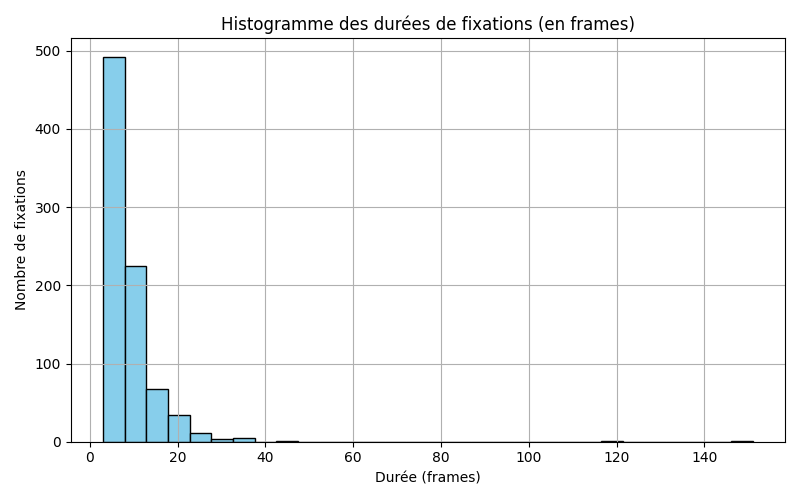
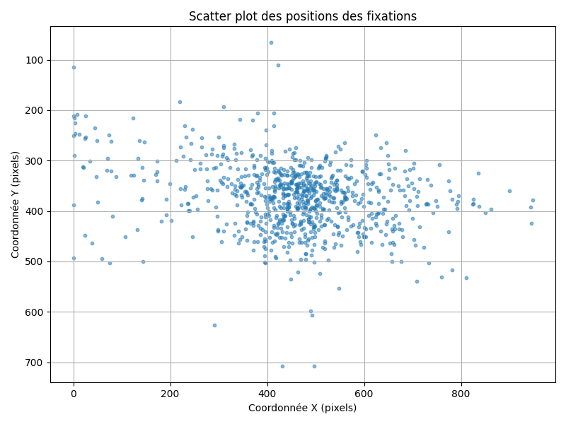
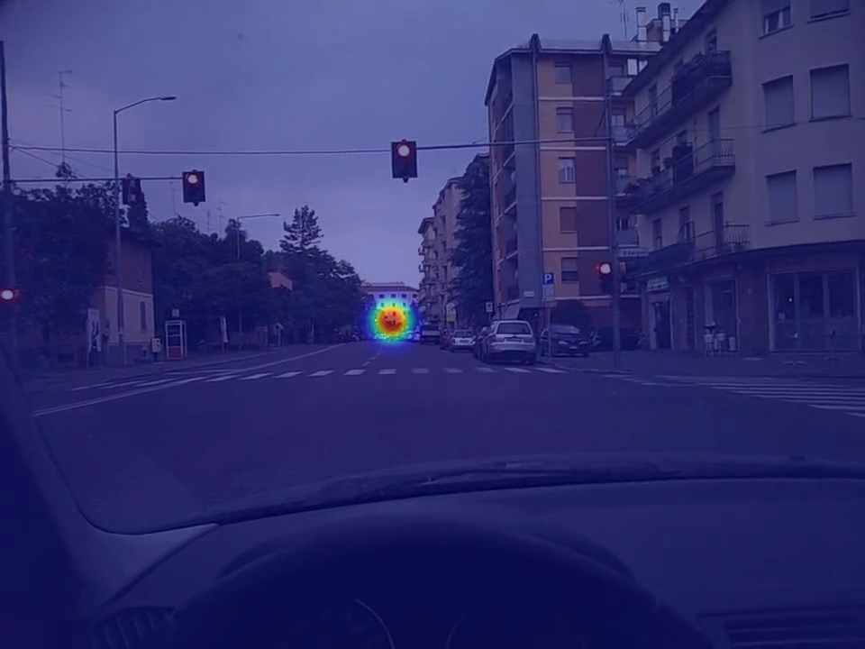

# Eye-Tracking Based Visual Attention Analysis

This project performs a detailed behavioral analysis of visual attention using **eye-tracking data recorded during video viewing**.  
It extracts, preprocesses, analyzes, and visualizes gaze fixations to understand spatial and temporal patterns of attention.

---

## Dataset

The raw gaze data used in this project was obtained from an **eye-tracking dataset available on Kaggle**.  
The dataset contains gaze coordinates associated with video frames, recorded at a higher sampling rate than the video frame rate.  
Key properties of the data:
- **Frames range**: 1 – 8992 (some frames missing due to blinks, detection loss, or acquisition artifacts).
- **Total gaze points**: 7,558.
- **Multiple gaze points per frame** possible due to higher sampling frequency.

---

## Processing Pipeline

The project is organized into sequential scripts, each producing intermediate outputs:

1. **Frame Extraction** (`01_extract_frames.py`)  
   Extracts video frames for the analyzed sequence.  
   - Output: `9001` frames in `data/frames/Type_1/11/`.

2. **Gaze Preprocessing** (`02_preprocess_gaze.py`)  
   Cleans gaze data, removes invalid points, and saves as `gaze.csv`.

3. **Metrics Computation** (`03_analyze_metrics.py`)  
   Detects fixations and computes summary metrics.  
   - Total fixations: **840**  
   - Avg. fixation duration: **8.26 frames** (~275 ms at 30 FPS)  
   - AOI central coverage: **73.66%**

4. **Visualization of Metrics** (`04_visualize_analysis.py`)  
   Generates:  
   - Fixation duration histogram.  
   - Scatter plot of fixation positions.  
   Saved in `outputs/metrics/`.

5. **Heatmap Video Generation** (`05_generate_heatmap_fixations.py`)  
   Creates a heatmap video showing fixation density over time.  
   Saved in `outputs/videos/`.

6. **Fixation Statistics Summary** (`06_fixation_stats.py`)  
   Produces detailed fixation statistics (mean, median, std, min, max, quartiles).  
   Saved in `outputs/metrics/fixations_summary_stats.csv`.

---

## Analysis Highlights

- **Spatial attention**: Majority of gaze points fall in the predefined **central Area of Interest (AOI)**, bounded by `(xmin=288, xmax=672, ymin=270, ymax=450)` on a `960×720 px` frame.
- **Fixation duration distribution**:  
  Most fixations are short (3–10 frames), indicating rapid scanning behavior.  
  A few long fixations (>100 frames) suggest moments of strong engagement.
- **Dispersion**: Horizontal spread is larger than vertical, suggesting lateral exploration.

---

## Visual Outputs

### 1. Fixation Duration Histogram


### 2. Fixation Positions Scatter Plot


### 3. Heatmap Video (Fixations Over Time)
*Example frame from the generated heatmap video*  


---

## Methods Overview

### Fixation Detection
- Based on **minimum spatial dispersion** and **minimum temporal duration**.
- A fixation is detected when:
  - At least **3 consecutive gaze samples** remain within a small spatial tolerance.
  - This threshold corresponds to ~100 ms at 30 FPS.

### AOI Definition
- Center rectangle covering **40% of frame width** and **25% of frame height**.
- Choice motivated by:
  - Expected position of relevant stimuli.
  - Observed concentration of gaze points during exploratory analysis.

### Statistical Analysis
- Computation of mean, median, std, and range for fixation durations and positions.
- Visualizations for temporal and spatial distribution of fixations.

---

## Project Structure

├── data/
│ ├── frames/ # Extracted video frames
│ └── gaze.csv # Preprocessed gaze data
├── outputs/
│ ├── metrics/ # Plots & statistics
│ └── videos/ # Heatmap video
├── 01_extract_frames.py
├── 02_preprocess_gaze.py
├── 03_analyze_metrics.py
├── 04_visualize_analysis.py
├── 05_generate_heatmap_fixations.py
├── 06_fixation_stats.py
└── README.md

---

# Gaze and Fixation Analysis

This repository contains scripts for analyzing gaze data, including extracting frames from video, preprocessing gaze points, and generating various visualizations and statistics.

---

## How to Run

1.  **Extract frames** from the video:
    ```bash
    python 01_extract_frames.py
    ```

2.  **Preprocess gaze data**:
    ```bash
    python 02_preprocess_gaze.py
    ```

3.  **Run fixation analysis**:
    ```bash
    python 03_analyze_metrics.py
    ```

4.  **Generate visualizations**:
    ```bash
    python 04_visualize_analysis.py
    ```

5.  **Create heatmap video**:
    ```bash
    python 05_generate_heatmap_fixations.py
    ```

6.  **Export fixation statistics**:
    ```bash
    python 06_fixation_stats.py
    ```

---

## Key Results Summary

| Metric | Value |
| :--- | :--- |
| Total gaze points | 7,558 |
| Total fixations | 840 |
| Avg. fixation duration | 8.26 frames (~275 ms) |
| Max. fixation duration | 151 frames (~5 s) |
| AOI central coverage | 73.66% |
| Mean fixation position | (457 px, 374 px) |
